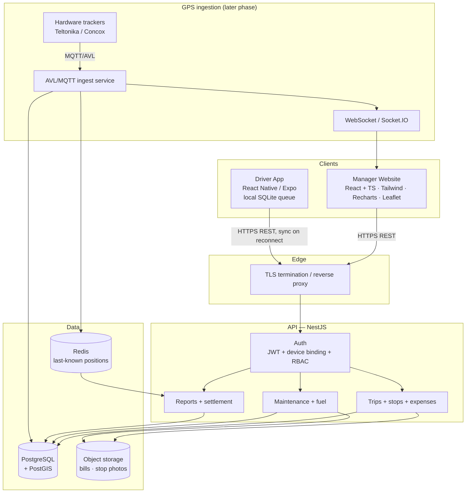
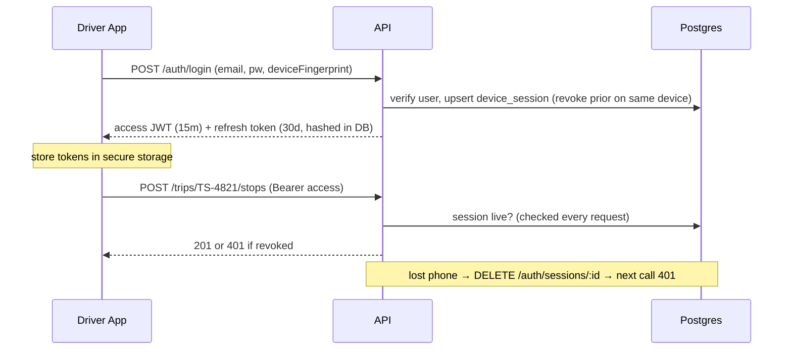
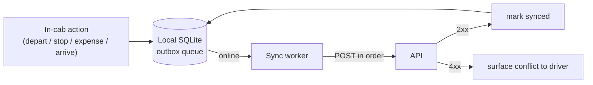
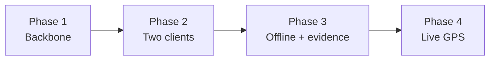

# TankerTrack — System Architecture

Ethanol fleet transportation management system for **Green Energy**. Two
clients over one API and one database:

- **Manager website** — dispatch scheduling, live fleet tracking, trip reports,
  and workshop / cost tracking. Desktop-first.
- **Driver mobile app** — a downloadable app the driver uses in-cab: open a trip
  by ID, log departure/stops/expenses/arrival. Offline-tolerant.

Both talk to the same role-aware API. Nothing the driver does is trusted blindly
— authorisation rules live server-side and in the database.

> **Status legend used throughout:** ✅ built & verified · 🟡 written, not yet run
> (no Node/blocked binaries on the current machine) · ⬜ planned / not started.
> See [apps/api/README.md](../apps/api/README.md) for what has actually been
> exercised.

---

## 1. Requirements

### Functional

| Area | Capability | Client |
| --- | --- | --- |
| Dispatch | Schedule a trip: vehicle, driver, route, max stops, load, deadline, advance, invoice, expected return | Manager web |
| Dispatch | Issue a Trip ID the driver enters in the app | Manager web |
| In-cab | Open trip by ID, confirm departure (weight + opening odometer) | Driver app |
| In-cab | Log stops (location, type, time); server flags unauthorized | Driver app |
| In-cab | Add trip expenses (Food/Parking/Unloading/RTO + extras) with receipts | Driver app |
| In-cab | End trip (arrival weight, closing odometer, diesel litres) | Driver app |
| Reporting | Auto trip report: duration, delivered qty, stops, inactivity gaps | Manager web |
| Settlement | Standardised trip sheet: expenses total, advance, balance, mileage | Manager web |
| Costs | Log maintenance with mandatory bill; spend rollups; service-due | Manager web |
| Costs | Fuel log + odometer readings; tank-to-tank mileage per vehicle | Manager web |
| Fleet | Live map of last-known truck positions | Manager web |

### Non-functional

- **Scale (near-term):** 15 trucks, ~2 depots, tens of trips/day, a handful of
  concurrent manager users. This is a *small-fleet* system — the design target
  is correctness and auditability, **not** high throughput.
- **Scale (GPS phase):** if trackers ping every 10–30 s, 15 trucks ≈ 30–90
  pings/min sustained. Still modest, but it is the highest-volume path and the
  only one that needs partitioning thought.
- **Availability:** manager web can tolerate short downtime; the driver app
  **cannot** depend on connectivity — highway stretches drop signal, so in-cab
  actions must queue locally and sync later.
- **Auditability:** hazmat goods carriage — trip sheets and GPS history need an
  immutable trail (who logged what, when, where) and a retention policy.
- **Security:** driver PII, GPS history, and bill evidence encrypted at rest;
  TLS in transit; least-privilege data access per role.

### Constraints

- **Solo/small team, phased build.** Favour one boring stack over many.
- **Existing brief** already picks: React (web), React Native/Expo (mobile),
  NestJS + PostgreSQL + PostGIS, Redis, S3-compatible storage, JWT auth.
- **Current dev machine** has PostgreSQL 18 but **no Node**, no Docker, no
  PostGIS, and an app-control policy that intermittently blocks unsigned
  binaries. So TypeScript can be written but not compiled here, and even SQL
  verification is not always available. This shapes *what can be proven* now,
  not the target design.

---

## 2. High-Level Design

### Component responsibilities

| Component | Responsibility | Status |
| --- | --- | --- |
| **Manager website** | Dispatch, reports, workshop/costs, live map. React + TS + Tailwind, Recharts, Leaflet/Mapbox. | 🟡 prototype `tms-app.html` is now **manager-only** and persists via `store.js` (vanilla; React port pending) |
| **Driver app** | In-cab trip flow, offline queue, camera for bills, GPS. React Native / Expo. | 🟡 standalone `driver.html` prototype (mobile-shaped, own client, shares `store.js`); Expo port pending |
| **Shared store** | Stand-in for the API/DB: one persistent store both clients read/write, cross-tab live via `storage` events. The seam where real `fetch()` slots in. | ✅ `store.js` (localStorage) |
| **API** | Single role-aware backend serving both clients. NestJS. | 🟡 written, not run |
| **PostgreSQL** | System of record. All domain rules as constraints/triggers. | ✅ 001–004 verified · 🟡 005 written |
| **Object storage** | Bill scans + stop photos, encrypted, served by presigned URL. | 🟡 `StorageService` written |
| **Redis** | Cache last-known truck position for the live map. | ⬜ |
| **GPS ingestion** | Trackers → PostGIS → WebSocket. Replaces rule-based stop flags with geofence deviation. | ⬜ (schema stubbed in migration 003) |

### Why one API for two clients

The manager and driver are not two systems — they are two **views with
different permissions** over the same trips. Splitting the backend would force
the same trip-state and settlement logic to exist twice and risk them drifting.
Instead, one API enforces role scope:

- **Driver** sees only their own active trip; can depart, log stops, add
  expenses, arrive. Has **no** route to change the advance, invoice, or any
  scheduling field.
- **Dispatcher** sees their depot's fleet; schedules trips; reads reports and
  costs.
- **Fleet manager / admin** see the whole fleet; fleet-wide export and config.

---

## 3. Deep Dives

### 3.1 Data model

```mermaid
erDiagram
  depots ||--o{ users : "scoped to"
  depots ||--o{ vehicles : "based at"
  users ||--o{ device_sessions : "logs in from"
  vehicles ||--o{ trips : "assigned"
  users ||--o{ trips : "drives / dispatches"
  trips ||--o{ trip_stops : "has"
  trips ||--o{ trip_expenses : "has"
  vehicles ||--o{ maintenance_records : "serviced by"
  maintenance_records ||--|| maintenance_bills : "must have"
  vehicles ||--o{ fuel_log : "fuelled"
  trip_expenses }o--o| maintenance_bills : "optional receipt"
  trips ||--o| trip_settlement : "computed"
```

Key tables (see `apps/api/db/migrations`):

- **trips** — the whole lifecycle: scheduled → active → completed/cancelled.
  Manager-set columns (advance, invoice, phone, expected return) and
  driver-set columns (odometers, diesel) live here; distance is a generated
  column.
- **trip_stops** / **trip_expenses** / **audit_log** — **append-only** (triggers
  block UPDATE/DELETE). Corrections are new rows, never edits. This is the
  hazmat audit requirement made structural.
- **maintenance_records** — `bill_id` is `NOT NULL`, so "no bill, no record" is
  a database invariant, not a UI nicety.
- **fuel_log** + **fuel_mileage_spans** (view) — tank-to-tank mileage; odometer
  monotonicity enforced across both fuel and trip readings.
- **trip_settlement** (view) — expenses total, balance owed/recoverable,
  distance, mileage, computed in SQL.

Money is stored as **bigint minor units (paise)**; GST in **basis points**;
never floating point. Totals are generated columns so they cannot drift.

### 3.2 API surface (per role)

| Method | Route | Role |
| --- | --- | --- |
| POST | `/auth/login` · `/auth/refresh` | public |
| DELETE | `/auth/sessions/:id` | fleet manager, admin |
| POST | `/trips` | dispatcher+ |
| GET | `/trips` · `/trips/:ref` (report) | any (scoped) |
| POST | `/trips/:ref/depart` · `/stops` · `/expenses` · `/arrive` | driver |
| POST/GET | `/maintenance` · `/maintenance/bills` · `/summary` | dispatcher+ |

REST over JSON. No GraphQL — the surface is small and the clients' needs are
predictable, so REST keeps the driver app's offline replay trivial (a queue of
`POST`s to replay in order).

### 3.3 Auth & device binding

- Short-lived access token, long-lived **hashed** refresh token bound to one
  device fingerprint.
- Session liveness checked on **every** request, so revoking a lost handset
  takes effect immediately, not when the access token expires.
- Credential entry (password) happens only on the device — never brokered by
  the server.

### 3.4 Offline-first driver app

The single most important client-side decision. Highways drop signal, so the
app must be usable with no connectivity and reconcile later.

- Every in-cab action is written to a **local outbox** first and shown as
  "pending sync". A background worker replays the queue in order when signal
  returns.
- Because the server is the authority (it assigns stop sequence and decides
  authorisation), the client never computes final state — it just replays
  intent and re-reads the result. This avoids merge conflicts.
- **Idempotency:** each queued action carries a client-generated key so a
  replay after a flaky connection can't double-log a stop or expense.
- Bill/stop **photos** queue as local files and upload on reconnect, then the
  record references the returned object key.

### 3.5 Object storage for evidence

Bills and stop photos never live in Postgres and are never streamed through the
API process. They go to S3-compatible storage (MinIO locally, cloud in prod),
**content-addressed** by checksum, encrypted at rest, and served to clients by
**short-lived presigned URLs**. A crafted filename can't traverse or overwrite
anything because the storage key is derived from the hash, not the name.

### 3.6 GPS ingestion (later phase)

Hardware trackers → lightweight AVL/MQTT ingest service → PostGIS (`gps_pings`,
`geofences`) → publishes last-known position to Redis and a WebSocket feed for
the live map. This is what eventually **replaces the prototype's rule-based
"unauthorized stop" flag** with real geofence-deviation detection, evaluated
server-side so a compromised device can't suppress an alert. Schema is stubbed
in migration `003` (needs PostGIS); the ingest service is not built.

---

## 4. Scale & Reliability

- **Load:** trivial for the transactional paths (15 trucks). The only path that
  grows is `gps_pings` — at ~90 pings/min it is ~4M rows/month. Partition
  `gps_pings` by month before it gets large; everything else is fine on a single
  managed Postgres instance for years.
- **Scaling shape:** vertical first. The API is stateless (JWT + DB), so if the
  manager user count ever grew it scales horizontally behind the load balancer
  with no session affinity. Redis and Postgres are the only stateful pieces.
- **Reliability:** managed Postgres with automated backups + PITR (retention set
  to the hazmat regulatory minimum). Object storage versioned. The driver app's
  offline queue *is* the reliability story for in-cab data — a dropped request
  is never lost, just deferred.
- **Monitoring:** health checks on API↔DB (already: the API refuses to start if
  the DB is unreachable or unmigrated), request/error metrics, and alerts on
  ingest lag once GPS is live.

---

## 5. Trade-offs & Decisions

| Decision | Chosen | Alternative | Why |
| --- | --- | --- | --- |
| Backend count | One API, two clients | Separate manager/driver backends | Trip + settlement logic exists once; RBAC gives the split. |
| Rule enforcement | In the database (constraints/triggers) | In the service layer only | A compromised device or a second writer can't bypass the DB. Matches the brief's "server-side, not client-side" mandate. |
| API style | REST/JSON | GraphQL | Small, predictable surface; makes the driver app's offline replay a simple ordered queue. |
| Driver client | Native app (Expo) | Mobile web | Camera, GPS, and offline SQLite need native; must work one-handed in-cab. |
| Corrections | Append-only + reversing entries | Editable rows | Hazmat audit trail must be immutable. |
| Money | bigint paise + generated totals | float / computed in JS | No rounding drift; totals can't disagree with their parts. |
| Diesel on trip sheet | Litres only, feeds mileage | Cash expense | Matches the real sheet; diesel is fuel-card settled, not from the advance. |

**What I'd revisit as it grows:** partition `gps_pings` and add a time-series
rollup for the live map; introduce Redis read-through caching for the dashboard
only if query latency becomes visible; consider per-depot data isolation if the
fleet expands beyond a couple of depots.

---

## 6. Build Phases

| Phase | Scope | Depends on |
| --- | --- | --- |
| **1 — Backbone** ✅🟡 | Postgres schema (001–005), NestJS API with auth/RBAC, trips, maintenance, fuel, settlement. | Node installed to run/verify the API. |
| **2 — Two clients** 🟡 | ✅ Prototype split done: `tms-app.html` (manager-only) + `driver.html` (standalone mobile app) share one persistent store (`store.js`), so a trip scheduled on the website is opened and completed in the app and flows back. ⬜ Remaining: port to React (web) + Expo (mobile) and repoint `store.js` at the real API. | Phase 1 running. |
| **3 — Offline + evidence** ⬜ | Driver app local SQLite outbox + sync worker + idempotency keys; camera → object storage for bills and stop photos. | Phase 2. |
| **4 — Live GPS** ⬜ | Tracker vendor + AVL/MQTT ingest service; PostGIS geofences replacing rule-based stop flags; Redis + WebSocket live map. | PostGIS; hardware decision. |

### Immediate next steps

1. **Install Node 20+** on the build machine so the API can be compiled, run,
   and its TypeScript verified (currently written-not-run).
2. **Split `tms-app.html`** into a manager-only website and a standalone driver
   app so the two-client boundary is real, then wire each to the API.
3. **Stand up Postgres + MinIO** (Docker compose) so the API has a database and
   object store to talk to end-to-end.

---

## 7. Open Decisions (carried from the brief)

- Real geofencing logic to replace the rule-based unauthorized-stop flag.
- Inactivity threshold: currently per-trip (default 45 min) — tune by route
  length/type.
- GPS tracker vendor and integration protocol.
- Full depot list, 15-vehicle roster, driver roster for seed data.
- Whether offline queuing ships in the driver app from day one (recommended:
  yes — it is Phase 3 here, but the data model already supports it).
