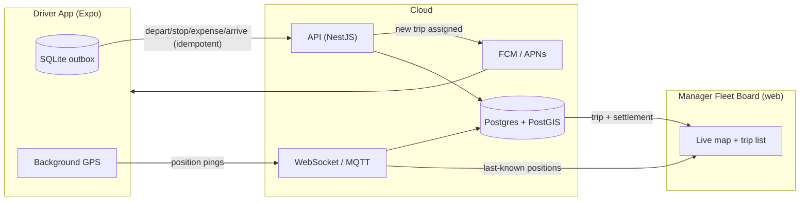

# Requirements — Driver App as an Installable, Connected App

What it takes to turn `driver.html` (today: a browser prototype on a shared
localStorage store) into an app a driver **installs on a phone**, that is
**connected live to the manager fleet board**.

The manager board and the driver app are two ends of one system. "Connected"
means: a trip dispatched on the board appears on the phone; stops/expenses/
arrival logged on the phone appear on the board; and — with GPS — the truck's
live position shows on the board's map.

---

## 0. Decide the packaging route

| Route | What it is | Pros | Cons | When |
| --- | --- | --- | --- | --- |
| **PWA** (installable web app) | Wrap the existing HTML as a Progressive Web App | Fastest; reuses `driver.html` almost as-is; installs from a URL, no store | Weak background GPS on iOS; limited native feel; no store presence | Interim / pilot |
| **React Native (Expo)** ✅ brief | Native app, one codebase iOS+Android | Real background GPS, camera, push, offline SQLite, store distribution | Rewrite the UI in RN; build/release pipeline | The product |

Recommendation: **Expo** for the real app (matches the brief and the fleet's
needs — in-cab, one-handed, offline, background location). A PWA is a reasonable
2-week pilot to validate the workflow on real phones first.

---

## 1. Backend prerequisites (must exist before the app is useful)

The app is only as connected as the backend it points at.

- **Deployed API on a real host with TLS** — not `localhost`. A domain
  (`api.tankertrack.…`), HTTPS, the NestJS API from `apps/api` running against
  managed Postgres + object storage. (See [LOCAL-DEPLOYMENT.md](LOCAL-DEPLOYMENT.md)
  for the shape; production swaps in managed services and the least-privilege DB
  role.)
- **Auth endpoints live** — `POST /auth/login`, `/auth/refresh`, session revoke.
  A real driver login (phone + OTP, or email + password) — not the prototype's
  "type a Trip ID".
- **Realtime channel** — WebSocket (Socket.IO) or MQTT for two things: pushing
  new trip assignments to the phone, and streaming the phone's GPS to the board.
- **Push notifications** — FCM (Android) + APNs (iOS) so a newly dispatched trip
  buzzes the driver even with the app closed.
- **Object storage with presigned uploads** — the app uploads bill/stop photos
  directly to storage via a short-lived presigned URL from the API (already the
  server code path).
- **Maps** — a tile/geocoding provider key (Mapbox or OSM/Leaflet) for the
  board's live map and any in-app map.

---

## 2. App-side requirements

### 2.1 Replace the store with an API client
Today `store.js` is localStorage. In the app it becomes an API client:
`TankerStore.load/save` → authenticated `fetch()`/WebSocket calls to `/api/v1`.
This is the whole reason `store.js` exists as a seam — the screens don't change.

### 2.2 Authentication & session
- Real login screen (phone+OTP recommended for drivers).
- **Secure token storage** — Expo `SecureStore` (iOS Keychain / Android
  Keystore), never plain storage.
- Access + refresh token handling, silent refresh, and honouring server-side
  **remote revoke** (lost phone → board revokes → app logs out).
- **Device binding / attestation** — Play Integrity (Android) / DeviceCheck or
  App Attest (iOS) so the bound device can't be spoofed (see flaw #6).

### 2.3 Offline-first (non-negotiable for in-cab)
- **Local SQLite outbox** — every action (depart, stop, expense, arrive) is
  written locally first and shown "pending sync".
- **Sync worker** replays the queue in order when connectivity returns.
- **Idempotency key per action** so a replay never double-posts (flaw #9).
- Photos queue as local files, upload on reconnect, then the record references
  the returned object key.

### 2.4 Device capabilities & permissions
- **Background GPS** — `expo-location` with background permission; stream
  positions to the board (this is what puts the truck on the map). Needs the
  iOS "Always" location entitlement and a clear purpose string.
- **Camera** — `expo-camera` / image picker for bill and stop photos.
- **Notifications** — `expo-notifications` for trip assignments and messages.
- Graceful permission prompts with rationale; the app must still function (queue
  locally) if location is temporarily denied.

### 2.5 Connection to the fleet board (the live link)

---

## 3. Distribution & release

- **Developer accounts** — Google Play Console (one-time $25) and Apple Developer
  Program ($99/yr). Required to ship, even internally.
- **Build pipeline** — Expo **EAS Build** (cloud builds for iOS+Android) and
  **EAS Submit** to the stores.
- **Distribution model** for a 15-driver fleet — you likely don't need public
  store listings:
  - **Internal testing tracks** (Play Internal Testing / Apple TestFlight), or
  - **MDM / managed devices** if the trucks use company phones (push the app
    silently, lock it down), or
  - **Enterprise / unlisted** distribution.
- **Code signing** — managed by EAS (iOS certs/provisioning, Android keystore);
  keep the Android upload key safe.
- **OTA updates** — Expo Updates for pushing JS fixes without a store review.

---

## 4. Security & compliance (hazmat)

- Encrypted token + local DB storage; consider SQLCipher for the outbox if it
  holds PII.
- **Certificate pinning** to the API.
- Immutable audit trail server-side (already designed) — every in-cab action
  attributed with time + GPS.
- PII minimisation on device; wipe on logout/revoke.
- Data retention per hazardous-goods regulation.

---

## 5. Operations

- **Crash/error reporting** — Sentry (Expo integration).
- **App versioning + force-upgrade** — a min-supported-version check the API can
  enforce, so old clients can be retired.
- **Remote config / feature flags** for staged rollout.
- **Observability** — sync-lag and GPS-freshness metrics on the board so
  dispatch can see which trucks are reporting.

---

## 6. Phased checklist

**Phase A — connect the prototype (no native yet)**
- [ ] Deploy API + Postgres + storage with TLS (Docker compose → a host).
- [ ] Real auth (login, token, refresh, revoke).
- [ ] Repoint `store.js` at the API; drop localStorage.
- [ ] Ship as a **PWA** to validate on real phones.

**Phase B — native app**
- [ ] Rebuild the driver UI in Expo (screens already designed in `driver.html`).
- [ ] SecureStore tokens; offline SQLite outbox + idempotent sync.
- [ ] Camera for bills; background GPS streaming to the board.
- [ ] Push notifications (FCM/APNs) for trip assignment.
- [ ] EAS Build + internal distribution (TestFlight / Play Internal).

**Phase C — live fleet board link**
- [ ] WebSocket/MQTT ingest; last-known position in Redis; live map on the board.
- [ ] Device attestation; cert pinning; crash reporting; force-upgrade.
- [ ] Geofence-deviation stop flagging (replaces the rule — see flaw #14).

---

## 7. Rough cost checklist

| Item | Cost |
| --- | --- |
| Apple Developer Program | $99 / year |
| Google Play Console | $25 one-time |
| Expo EAS (builds) | free tier, then paid by volume |
| Push (FCM/APNs) | free (FCM); APNs via Apple account |
| Maps (Mapbox/OSM) | usage-based; OSM/Leaflet self-host is cheapest |
| Managed Postgres + object storage + API host | cloud usage-based |
| Per-truck GPS trackers (optional, if not phone-only) | hardware capex |

---

### The short answer

To make the driver app real and connected you need, in order: **(1) the API
deployed with TLS and real login; (2) `store.js` repointed at it; (3) the UI
rebuilt in Expo with secure token storage, an offline outbox, camera and
background GPS; (4) a build/distribution pipeline (EAS + internal tracks); and
(5) a realtime channel so the phone's position and the dispatched trips flow
between the app and the fleet board.** Everything above (1) can start the day
Node/Docker are available on a build machine — the backend and the shared-store
seam are already designed for exactly this.
